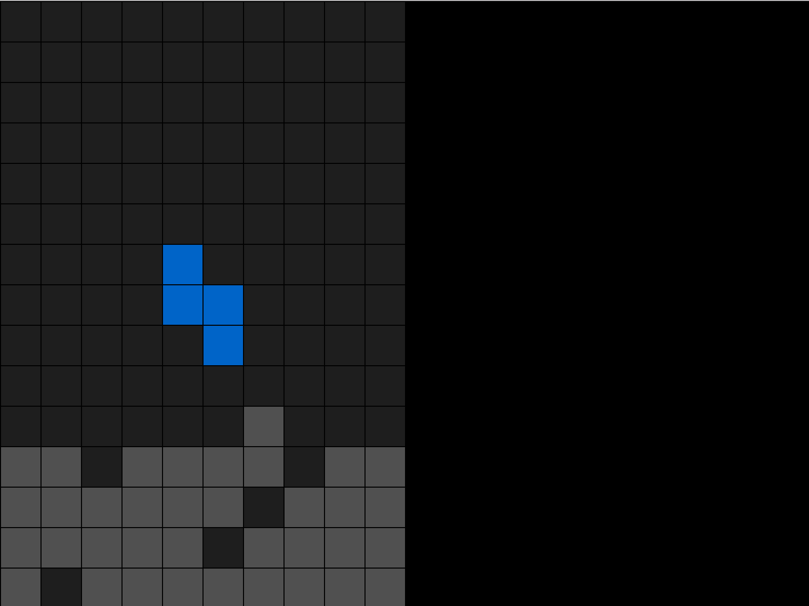

#### Soviet tetris with SDL2

`Status`: In development...



Project:
```text
├── main
│   └── src
│       ├── GameHandler  // Contains game loop (input, update, draw)
│       ├── Component    // Game components  
│       └── Setting      // General game enums settings
└────────── Util         // Utilities, like random generator
```

#### Inspiration and ideas
 - [Tetris on wiki](https://en.wikipedia.org/wiki/Tetris)
 - [Text guide for SDL 1](http://javilop.com/gamedev/tetris-tutorial-in-c-platform-independent-focused-in-game-logic-for-beginners/)
 - [Video guide](https://www.youtube.com/watch?v=htfB7D2ruXw)
 
