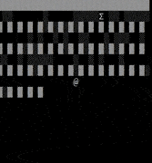
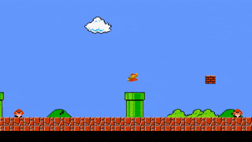

# Simple demo games with C++

> Inspiret with old school titles 🎲
> These games can be incomplete, so that means they can miss UI components, game mechanics, or game over screens.

---

## Game list 🎮

| Text based (ASCII) | |
| ------------- | ------------- | 
| [Raycasting Maze](ASCII/Rogesci) |  |
| [Bomber Console](ASCII/BomberConsole) |  |

| SFML | |
| ------------- | ------------- | 
| [Tetris](SFML/NeonTetris) |  |
| [Super Mario Bros. NES](SFML/SuperMarioBros) |  |

| SDL2 | |
| ------------- | ------------- | 
| [Tetris](SDL2/Tetris) |  |

---

## FAQ 🌟 

- **Visual studio configuration**
    - You can face down an issue with the building (missing links, symbols, etc.). Make sure you downloaded MSVC for desktop dev with C++
    - SFML 2.5.1 Requires platform toolset VS 2017 (v141) and check Windows SDK 10.0
- **Where sprites come from**
	- They made by me or I found them at https://www.spriters-resource.com/.
---
