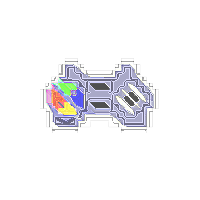
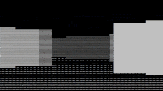
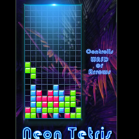
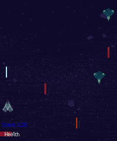
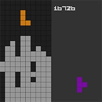

<table>
  <tbody>
    <tr>
      <td><b>About 👾</b></td>
      <td width="50%" rowspan="4">
        
      </td>
    </tr>
    <tr>
      <td>
        

            Inspired with old school titles 🎲
            This repository contains a collection of different game mechanics, systems, and experiments.
        

      </td>
    </tr>
    <tr><td><b>Game Development🧙</b></td></tr>
    <tr>
      <td width="50%">
        

            The development platform was Windows or Linux Debian and projects may not compile on other platforms.
            Project dependencies related to the platform must be installed manually or by package managers.
            Technologies are the most stable but over time abstract libraries for graphics, and audio processing like SDL or SFML may be updated.
            Since it's more like PoC or experiments, code tested manually and algorithms are not optimal.
        

      </td>
    </tr>
  </tbody>
</table>

---

<table>
    <tr>
        <td>
            
        </td>
        <td>
            <a href="./ASCII/Rogesci">Raycasting - Maze</a>
            
[C++, Windows Command Prompt, ASCII]

        </td>
        <td>
            
        </td>
        <td>
            <a href="./ASCII/Bomber">Bomber Console</a>
            
[C++, Windows Command Prompt, ASCII]

        </td>
    </tr>
    <tr>
        <td>
            
        </td>
        <td>
            <a href="./SFML/NeonTetris">Tetris</a>
            
[C++, SFML]

        </td>
        <td>
            
        </td>
        <td>
            <a href="./SFML/Spacing">Space Shooter</a>
            
[C++, SFML]

        </td>
    </tr>
    <tr>
        <td>
            
        </td>
        <td>
            <a href="./SDL2/Tetris">Tetris</a>
            
[C++, SDL2]

        </td>
        <td>
            
        </td>
        <td>
            <a href="./SFML/SuperMarioBros">Super Mario Bros - First level copy (scrolling logic)</a>
            
©Nintendo Co., Ltd.

            
[C++, SFML]

        </td>
    </tr>
</table>

---

## Notes 🌟

- Assets made by me, or I found them at https://www.spriters-resource.com
- Projects with SFML require **Visual Studio 2017 build tools** you can download them via Visual Studio Installer
---
